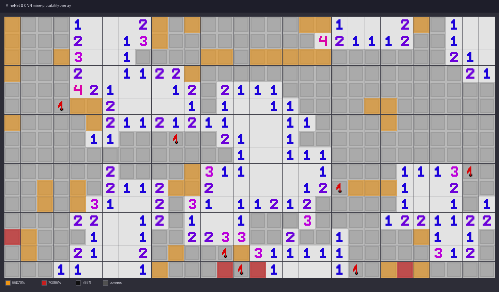

# MineNet — CNN-powered Minesweeper AI

> A convolutional neural network that learns to locate mines in Minesweeper by observing partially revealed board states, integrated directly into a playable Tkinter game.



[](LICENSE.txt)
[](https://www.python.org/downloads/)
[](https://pytorch.org/)

---

## Table of Contents

- [Overview](#overview)
- [Features](#features)
- [Architecture](#architecture)
- [Getting Started](#getting-started)
  - [Prerequisites](#prerequisites)
  - [Installation](#installation)
- [Usage](#usage)
  - [Play with AI assistance](#play-with-ai-assistance)
  - [Train a new model](#train-a-new-model)
  - [Visualize the model](#visualize-the-model)
- [How it Works](#how-it-works)
- [Project Structure](#project-structure)
- [Contributing](#contributing)
- [License](#license)

---

## Overview

MineNet trains a deep CNN to predict the probability that each covered tile hides a mine, given the current visible state of an **expert-difficulty** Minesweeper board (16 × 30, 99 mines). Once trained, the model is embedded in a live Tkinter game and overlays colour-coded risk indicators on every unrevealed tile in real time.

## Features

- **Playable game** — fully functional Minesweeper with left-click, right-click flagging, and auto-clearing of empty regions.
- **Live AI inference** — middle-click anywhere on the board to overlay mine-probability heat maps without interrupting play.
- **Colour-coded risk levels**

  | Colour | Predicted mine probability |
  |--------|---------------------------|
  | 🟠 Orange | 60 – 80 % |
  | 🔴 Red    | 80 – 90 % |
  | ⚫ Black  | > 90 %    |

- **Synthetic data generation** — training data is generated on-the-fly via `MinesweeperIterableDataset`, so no static dataset is required.
- **TensorBoard logging** — loss curves and board visualizations are logged during training.
- **Model analysis toolkit** — convolutional filter visualization, activation maps, and gradient inspection via `mine_visualize.py`.

## Architecture

`MinesweeperCNN` is a fully convolutional network with four residual-style blocks followed by a 1 × 1 output convolution. It takes a **2-channel input** of shape `(2, H, W)`:

| Channel | Content |
|---------|---------|
| 0 | Board state — cell values (`-2` = covered, `0–8` = revealed, `-1` = mine) |
| 1 | Mines density — scalar `n_mines / (H × W)` broadcast across the board |

The output is a single-channel probability map of shape `(1, H, W)` in `[0, 1]`.

```
Input (2, 16, 30)
   │
   ├── Block 1: Conv2d 2→32→32→64, kernel 2×2, ReLU, BatchNorm
   ├── Block 2: Conv2d 64→64→64→64, kernel 3×3, ReLU, BatchNorm
   ├── Block 3: Conv2d 64→128→128→128, kernel 5×5, ReLU, BatchNorm
   ├── Block 4: Conv2d 128→256, kernel 7×7, ReLU, BatchNorm
   └── Output:  Conv2d 256→1, kernel 1×1, Sigmoid
```

Training uses **MSE loss** and the **RMSprop** optimizer with a `ReduceLROnPlateau` scheduler.

## Getting Started

### Prerequisites

- Python 3.8 or higher
- A CUDA-capable GPU is recommended for training (CPU works for inference)

### Installation

```bash
git clone https://github.com/<your-username>/mine_net.git
cd mine_net

# Create and activate a virtual environment (recommended)
python -m venv .venv
source .venv/bin/activate        # Linux / macOS
.\.venv\Scripts\Activate.ps1    # Windows PowerShell

# Install dependencies
pip install torch torchvision numpy matplotlib seaborn opencv-python tensorboard keras
```

> **Note:** Install the PyTorch variant that matches your CUDA version from [pytorch.org](https://pytorch.org/get-started/locally/).

## Usage

### Play with AI assistance

```bash
python minesweeper.py
```

- **Left-click** — reveal a tile  
- **Right-click** — place / remove a flag  
- **Middle-click** — trigger the AI overlay (colours fade after the board state changes)

The game loads `mine_net_v2.h5` on startup. Make sure the model file is present in the project root.

### Train a new model

```bash
python mine_net_v2.py
```

Training runs for **50 epochs** by default (1 000 steps each) and saves:

| Path | Content |
|------|---------|
| `checkpoints/<timestamp>/best_model.pth` | Weights with lowest validation loss |
| `checkpoints/<timestamp>/checkpoint_epoch_N.pth` | Periodic checkpoints every 5 epochs |
| `checkpoints/<timestamp>/plots/` | Loss curves and prediction visualizations |
| `runs/minesweeper_<timestamp>/` | TensorBoard event files |

Monitor training in real time:

```bash
tensorboard --logdir runs/
```

Key hyperparameters are at the top of `mine_net_v2.py`:

```python
SIZE_X    = 16    # board height
SIZE_Y    = 30    # board width
N_MINES   = 99    # default mine count
```

### Visualize the model

`mine_visualize.py` provides the `ModelAnalyzer` class with three capabilities:

```python
from mine_net_v2 import MinesweeperCNN
from mine_visualize import ModelAnalyzer
import torch

model = MinesweeperCNN()
model.load_state_dict(torch.load("checkpoints/.../best_model.pth")["model_state_dict"])

analyzer = ModelAnalyzer(model, device='cpu')
analyzer.visualize_filters('block1.0')          # convolutional filter grid
analyzer.get_activation_maps(input_tensor)      # intermediate feature maps
```

## How it Works

1. **Data generation** — `MinesweeperIterableDataset` randomly produces board snapshots. Each sample is either a board reached by a sequence of safe clicks, or a board with a random fraction of non-mine tiles revealed.

2. **Input encoding** — The visible board is stacked with a uniform mine-density channel so the network can adapt to boards with different mine counts.

3. **Training objective** — The network minimises MSE between its per-cell output and a binary ground-truth mask (1 = mine, 0 = safe).

4. **Inference** — During play, `minesweeper.py` assembles the current visual board, runs a forward pass through the loaded model, and re-colours each covered tile according to the predicted probability.

## Project Structure

```
mine_net/
├── minesweeper.py        # Tkinter game + AI overlay (inference)
├── mine_net_v2.py        # MinesweeperCNN definition + training loop
├── mine_visualize.py     # ModelAnalyzer — filters, activations, gradients
├── minesweeper.ipynb     # Exploratory notebook
├── mine_net_v2.h5        # Pre-trained model (PyTorch, v2)
├── mine_net.h5           # Legacy model (Keras, v1)
├── images/               # Tile sprites used by the Tkinter game
├── LICENSE.txt
└── README.md
```

## Contributing

Contributions are welcome! Please follow these steps:

1. Fork the repository and create a feature branch: `git checkout -b feat/my-feature`
2. Make your changes and add tests where applicable.
3. Run a quick sanity check: `python mine_net_v2.py` with a short training run.
4. Open a pull request describing what you changed and why.

Areas that would benefit from contributions:

- Replacing the legacy Keras `mine_net.h5` inference path in `minesweeper.py` with the PyTorch v2 model
- Adding a proper requirements file (`requirements.txt` / `pyproject.toml`)
- Implementing auto-click mode where the AI plays the game autonomously
- Expanding board-size support beyond the hard-coded expert configuration

## License

This project is licensed under the [MIT License](LICENSE.txt).  
Original Minesweeper implementation © 2017 Paulius J.
